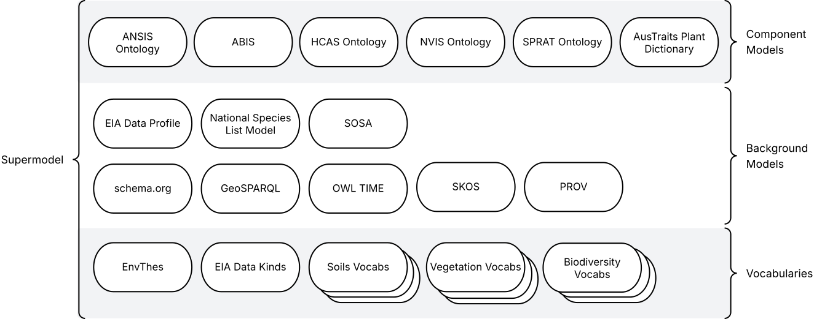

= Environmental Information Australia Supermodel
:favicon: images/logo-qld.svg
:toc: left
:toclevels: 3
:table-stripes: even
:sectnums:
:sectids:
:sectanchors:

This 'Supermodel' is a set of data models used by DCCEEW to integrate data from formerly separate systems into an interoperable whole.

As of July 2025, this Supermodel is used for data integrations only.

[NOTE]
====
This Supermodel is demonstrated through the https://eia.testing.bdr.gov.au/[EIA Test Catalogue], online via the Biodiversity Data Repository's infrastructure.
====

== Metadata

[width=85%, frame=none, grid=none, cols="2,5"]
|===
|**IRI** | https://linked.data.gov.au/def/eia-supermodel
|**Title** | EIA Supermodel
|**Description** | This is an overarching model - a Supermodel - used to integrate multiple, individual, models together for use within a particular scenario.
|**Created** | 2025-02-15
|**Modified** | 2025-07-30
|**Issued** | 0000-00-00 - not in production use yet
|**Version** | 1
|**Creator** | https://kurrawong.ai[KurrawongAI], for DCCEEW
|**Publisher** | https://linked.data.gov.au/org/dcceew[Department of Climate Change, Energy, the Environment and Water (DCCEEW)]
|**License** | https://creativecommons.org/licenses/by/4.0/[Creative Commons Attribution 4.0 International (CC BY 4.0)]
|**Code Repository** | https://github.com/dcceew-bdr/eia-supermodel
|===

== Introduction

=== What is a Supermodel

A "supermodel" is a set of models that have been designed to allow for the integration of data from different datasets. They achieve this by ensuring the models for each dataset implement the same patterns for common elements, such as spatiality, and they contain reference data, such as controlled vocabularies of values, that the datasets refer to, providing join points.

This Supermodel follows the generic Supermodel Model defined at https://linked.data.gov.au/def/supermodel.

=== This Supermodel's Origins

Like all large and long-term data holders, the https://linked.data.gov.au/org/dcceew[Department of Climate Change, Energy, the Environment and Water (DCCEEW)] has many datasets that while they are conceptually related - within the environment domain - have been created separately and without interoperability as a priority. As a result, analysts must put lots of effort into aligning data before using multiple datasets together; effort that is likely duplicated by analysts unaware of others' work.

In early 2025, DCCEEW conducted a demonstration project called the _EIA Supermodel Demonstrator_ that aimed at showing how integration-ready data might appear and be used.

The target datasets for this work were several within DCCEEW's _Environmental Information Australia_ initiative and DCCEEW's then new https://bdr.gov.au[Biodiversity Data Repository] was used as the reference dataset: the one who's form subsets of other datasets would emulate. This was due to the BDR having been designed specifically for integration.

=== Dataset Scope

The scope of this Supermodel was set within its establishment project to be 6 DCCEEW datasets:

1. https://www.dcceew.gov.au/environment/environment-information-australia/national-vegetation-information-system[National Vegetation Information system (NVIS)]
2. https://www.dcceew.gov.au/environment/biodiversity/threatened[Species Risks Assessment Tool (SPRAT)]
3. https://fed.dcceew.gov.au/maps/13cce3e3f8f947d487ef788cdf5a0165/about[Habitat Condition Assessment System (HCAS)]
4. https://doi.org/10.1038/s41597-021-01006-6[Australian National Flora Traits (AusTraits)]
5. https://ansis.net[Australian National Soil Information System (ANSIS)]
6. https://bdr.gov.au[Biodiversity Data Repository]

This Supermodel contains _Component Models_ and partial, demonstration, datasets for each of these 6 EIA datasets, as well as 20+ supporting assets - background datasets, vocabularies, data validators - formulated according to the Supermodel Model specification. These are detailed below.

=== Modelling System

All the models in this Supermodel are implemented using the <<OWL, _Web Ontology Language_ OWL>>. OWL is a very widely used, standardised, formal modelling language. Unlike <<UML, UML>> models, OWL models natively have machine-readable forms allowing data made according to them to be automatically validated and processed into databases.

The BDR is natively modelled in OWL using the https://linked.data.gov.au/def/abis[ABIS] and AusTraits is too, using the https://bioportal.bioontology.org/ontologies/OBOE[OBOE], https://github.com/EcologicalTraitData/ETS[ETS] and https://dwc.tdwg.org/terms/[Darwin Core] models. There is a https://raw.githack.com/ANZSoilData/def-au-domain/main/doc/domain.html[pre-existing ANSIS OWL ontology] too, into which it's easy to transform data delivering service responses. The other 3 datasets - NVIS, SPRAT and HCAS - have had models, or partial model in OWL created for them, for the first time, within the project that generated this Supermodel

The Supermodel's constituent models are related to one another using <<PROF, _The Profiles Vocabulary_ PROF>> which provides properties to indicate when and how one model reuses - "<<profile, profiles>>" - another. PROF also links models to validators created to test data claiming conformance to them.

The technical presentation of data modelled in OWL is in <<RDF>> which is a graph ('node-edge-node') data structure. RDF allows models and data according to the models to be stored in files or databases of the same sort. RDF is also infinitely extensible, allowing for not just model change and growth but for easy schema change and growth too.

=== Patterns

Integrated use of multiple Component Models depends on each of them implementing, or mapping to, model elements in the Background Models referred to as <<pattern, patterns>>. The patterns of relevance to this EIA Supermodel do not make a finite list as patterns can exist within and overlap other patterns, however

=== Validation

For demonstrable interoperability, this Supermodel contains data validators for some of its Background and Component Models that test data claiming conformance to it against identified patterns. These validators are executable model specifications.

Some of the validators for the models within this Supermodel were created by the original model implementors, e.g. ABIS, but others have had validators created for this through the EIA Demonstrator project.

All the validators used within this Supermodel are implemented in <<SHACL, SHACL>>, an <<RDF>> data validation language.

=== Definitions

Here is a list of terms and acronyms used in this document.

[[BM]] Background Model:: A role within a Supermodel for low level or generic models that some, but not necessarily all, of the <<Component Models>> reuse and extend, depending on the patterns of data they contain.

[[CM]] Component Model:: A role within a Supermodel for the models of individual datasets within the set aiming for interoperability. Component Models must reuse and extend the Background Models.

Feature:: The class of object for "Anything spatial (being or having a shape, position or an extent)", according to <<GEO, GeoSPARQL>>

[[IRI]] IRI:: Internationalized Resource Identifiers (IRIs) are Internet protocol standard identifiers used to identify, and often to link to representations of, resources. IRIs add internationalisation (use of different character sets to) Uniform Resource Identifiers (URIs) which are a superset of Uniform Resource Locators (URLs). Where URLs - web addresses - must link to resources, URIs often do but need not. https://en.wikipedia.org/wiki/Internationalized_Resource_Identifier[[ref]]

[[pattern]] pattern:: In the context of a Supermodel, a pattern is a small data model and Background Models implement many patterns within them, either implicitly or explicitly

[[profile]] profile:: "A specification that constrains, extends, combines, or provides guidance or explanation about the usage of other specifications" according to <<PROF, The Profiles Vocabulary>>.

[[SM]] Supermodel:: A set of integrated data models used with defined roles used to make multiple datasets interoperable.

[[UML]] Unified Modelling Language, UML:: A general-purpose visual modeling language that is intended to provide a standard way to visualize the design of a system. https://en.wikipedia.org/wiki/Unified_Modeling_Language[[ref]]

Vocabulary:: A controlled set of defined terms. Within Supermodel contexts, all vocabularies reuse and extend the <<SKOS, SKOS>> vocabulary model.

Web Ontology Language, OWL:: A widely used international standard modelling language that allows for machine-readability of models.

== Models

=== Supermodel

This Supermodel is the total set models listed here.

==== Human-readable Form

This document contains the normative, human-readable description of the Supermodel.

The Supermodel is the total set of models listed below and is also conceived of as a <<profile, profile>> of the total set.

The models within this Supermodel and the roles they play are listed in the table below.

[cols="1,3,2,2"]
|===
|Name | Description | Role | PID

|Address Model | ... | <<CM, Component Model>> | `https://linked.data.gov.au/def/addr`
|Geographical Names Model | ... | <<CM, Component Model>> | `https://linked.data.gov.au/def/gn`
|Road Names Model | ... | <<CM, Component Model>> | `https://linked.data.gov.au/def/roads`
|Cadastral Model | ... | <<CM, Component Model>> | `https://linked.data.gov.au/def/cad`
|Cadastral Survey Data Model | ... | <<CM, Component Model>> | `https://linked.data.gov.au/def/csdm`
|===

==== Machine-readable Form

The machine-readable form of this Supermodel is an <<OWL, OWL>> model, formulated according to the <<PROF, Profiles Vocabulary>> and is online at:

* **https://linked.data.gov.au/def/eia-supermodel.ttl**

[id=fig-models]
.An informal diagram the part Models of this Supermodel. The Administrative Areas model is not yet defined.
image::images/models.png[]

For technical use, the machine-readable versions of the Backbone Model and the Component Models can be combined and used as the total Supermodel.

=== Backbone Model

The Backbone Model for this Queensland Spatial Information scenario overviewed in <<#fig-backbone, Figure 3>>. The elements of the Backbone Model are described next and the formal characterisation of the model in OWL is given in the machein-readable file https://spatial-information-qld.github.io/supermodel/backbone/model.ttl[backbone.ttl].

[id=fig-backbone]
.An OWL diagram of the Backbone Model overview. Uncertain objects are shown in light red.
image::images/backbone.png[]

Figure 2 indicates two main conceptual domains (the yellow and blue) centered on `Feature Labels` (defined here) and `geo:Feature` s which are "Anything spatial (being or having a shape, position or an extent)" <<GEO>>. Feature Labels are any form of identifying information assigned to a Feature <<xxx>>.

The class hierharchy expressed in this Backbone Model (with sub class of arrows) indicates that:

* `Address`, `AdministrativeArea` and perhaps `Title`` are all specialised forms of `FeatureLabel`
* `GeographicalName` is a form of `Address` (a very simple one!)
* `Geographical Objects` are a specialised form of `AddressableObject` and `AddressableObject` and `Parcel`, and others, are speciali types of `geo:Feature`

The various Component Models (next) use these classes of object and imlplement many more specilised forms of them.

==== Classes

This Backbone Model only defines one class of object not already defined in the various Component models: `FeatureLabel`.

[[FeatureLabel]]
===== Feature Label

[cols="1,4"]
|===
| Property | Value

| IRI | `bb:FeatureLabel`
| Preferred Label | Feature Label
| Definition | An annotation applied to a `Feature`. Specialised kinds of FeatureLabel are expected to be used, such as `Address` or `GeographicalName`
| Is Defined By | https://linked.data.gov.au/def/eia-supermodel/backbone[SQI Supermodel Backbone Model]
| Provenance | Derived from <<ISO19160-1>>'s `AddressLifecycle` class
| Expected Properties | <<isLabelFor, is label for>>
| Example 
a| [source,turtle]
----
# The Label "Mount Doom" is applied to Feature X
ex:fl-01
    a bb:FeatureLabel ;
    rdfs:label "Mount Doom" ;
    bb:isLabelFor ex:feature-x ;
.

ex:feature-x
    a geo:Feature ;
    ex:category ex:mountain ;
.
----
|===

==== Properties

This Backbone Model only defines one property not already defined in the various Component models: `isLabelFor`.

===== is label for

[cols="1,4"]
|===
| Property | Value

| IRI | `bb:isLabelFor`
| Preferred Label | is label for
| Definition | Indicates an an object that a <<FeatureLabel, `FeatureLabel`>> is an annotation for
| Is Defined By | https://linked.data.gov.au/def/eia-supermodel/backbone[SQI Supermodel Backbone Model]
| Sub property of | `rdfs:label`
| Domain | <<FeatureLabel, `FeatureLabel`>>
| Range | `geo:Feature`
| Example | _see the example for <<FeatureLabel>>_
|===

=== Component Models

==== ANZ National Address Model

The Address Model is a model that has been defined externally to this Supermodel.

It is available online at:

**https://linked.data.gov.au/def/addr**

==== Geographical Names Model

The Geographical Names Model is a model that has been defined externally to this Supermodel.

It is available online at:

**https://linked.data.gov.au/def/placenames**

==== Roads Model

The Roads Model is a model that has been defined externally to this Supermodel.

It is available online at:

**https://linked.data.gov.au/def/roads**

==== Cadastre Model

The Cadastre Model is a model that has been defined externally to this Supermodel.

It is available online at:

**https://linked.data.gov.au/def/cad**

:!sectnums:

== References

[[ADDR]] Address Model:: Intergovernmental Committee on Surveying & Mapping. _Address Model_, 2024. Semantic Web model. https://linked.data.gov.au/def/addr

[[CAD]] Cadastre Model:: Intergovernmental Committee on Surveying & Mapping. _Cadastre Model_, 2024. Proposed Semantic Web model. https://linked.data.gov.au/def/cad

[[CN]] Compound Naming Model:: Australian Government Linked Data Working Group, _Compound Naming Model_ 2023. Semantic Web model. https://linked.data.gov.au/def/cn

[[GEO]] GeoSPARQL:: Open Geospatial Consortium, _OGC GeoSPARQL - A Geographic Query Language for RDF Data, Version 1.1_, OGC® Implementation Specification (2024). http://www.opengis.net/doc/IS/geosparql/1.1

[[GN]] Cadastre Model:: Intergovernmental Committee on Surveying & Mapping. _Geographical Names Model_, 2024. Proposed Semantic Web model. https://linked.data.gov.au/def/gn

[[ISO19125-1]] ISO19125-1:: International Organization for Standardization, _ISO 19125-1: Geographic information — Simple Feature Access - Part 1: Common Architecture_, 2004. https://www.iso.org/standard/40114.html

[[OWL]] OWL:: World Wide Web Consortium, _OWL 2 Web Ontology Language Document Overview (Second Edition)_, W3C Recommendation (11 December 2012). https://www.w3.org/TR/owl2-overview/

[[PROF]] Profiles Vocabulary:: World Wide Web Consortium, _The Profiles Vocabulary_, W3C Working Group Note (18 December 2019). https://www.w3.org/TR/dx-prof/

[[RDF]] RDF:: World Wide Web Consortium, _RDF 1.1 Concepts and Abstract Syntax_, W3C Recommendation (25 February 2014). https://www.w3.org/TR/rdf11-concepts/

[[ROAD]] Road Names Model:: Intergovernmental Committee on Surveying & Mapping. _Road Names Model_, 2024. Proposed Semantic Web data model. https://linked.data.gov.au/def/roads

[[SDO]] schema.org:: W3C Schema.org Community Group, _schema.org_ 2015. Semantic Web model. https://schema.org

[[SHACL]] SHACL:: World Wide Web Consortium, _Shapes Constraint Language (SHACL)_, W3C Recommendation (20 July 2017). https://www.w3.org/TR/shacl/

[[SKOS]] SKOS:: World Wide Web Consortium, _SKOS Simple Knowledge Organization System_ 18 August 2009. Semantic Web model. https://www.w3.org/TR/skos-reference/