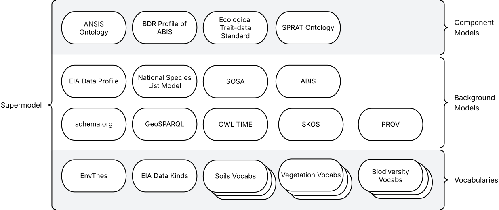

= Environmental Information Australia Supermodel
:favicon: images/logo-qld.svg
:toc: left
:toclevels: 3
:table-stripes: even
:sectnums:
:sectids:
:sectanchors:

A 'Supermodel' is set of data models used by to integrate data. This Supermodel is designed to allow DCCEEW to integrate Environmental Information Australia datasets.

[NOTE]
====
This Supermodel is demonstrated through the https://eia.testing.bdr.gov.au[EIA Test Catalogue] which delivers all parts of this Supermodel and demonstration data created to show integration. A https://eia.testing.bdr.gov.au/eia-demo[Scenario Demonstration] is also provided to test querying the data.
====

== Metadata

[width=85%, frame=none, grid=none, cols="2,5"]
|===
|**IRI** | https://linked.data.gov.au/def/eia-supermodel
|**Title** | EIA Supermodel
|**Description** | This is an overarching model - a Supermodel - used to integrate multiple, individual, models together for use within a particular scenario.
|**Created** | 2025-02-15
|**Modified** | 2025-08-30
|**Issued** | 2025-08-30
|**Version** | 1
|**Creator** | https://kurrawong.ai[KurrawongAI], for DCCEEW
|**Publisher** | https://linked.data.gov.au/org/dcceew[Department of Climate Change, Energy, the Environment and Water (DCCEEW)]
|**License** | https://creativecommons.org/licenses/by/4.0/[Creative Commons Attribution 4.0 International (CC BY 4.0)]
|**Code Repository** | https://github.com/dcceew-bdr/eia-supermodel
|===

== Introduction

=== What is a Supermodel

A "supermodel" is a set of models that have been designed to allow for the integration of data from different datasets. They achieve this by ensuring the models for each dataset implement the same patterns for common elements, such as spatiality, and they contain reference data, such as controlled vocabularies of values, that the datasets refer to, providing join points.

This Supermodel follows the generic Supermodel Model defined at https://linked.data.gov.au/def/supermodel.

=== This Supermodel's Origins

Like all large and long-term data holders, the https://linked.data.gov.au/org/dcceew[Department of Climate Change, Energy, the Environment and Water (DCCEEW)] has many datasets that while they are conceptually related - within the environment domain - have been created separately and without interoperability as a priority. As a result, analysts must put lots of effort into aligning data before using multiple datasets together; effort that is likely duplicated by analysts unaware of others' work.

In early 2025, DCCEEW conducted a demonstration project called the _EIA Supermodel Demonstrator_ that aimed at showing how integration-ready data might appear and be used.

The target datasets for this work were within DCCEEW's _Environmental Information Australia_ initiative and DCCEEW's then new https://bdr.gov.au[Biodiversity Data Repository] was used as the reference dataset: the one whose form other datasets would emulate. This was due to the BDR having been designed specifically for cross-dataset integration.

=== Dataset Scope

The scope of this Supermodel was set within its establishment project to initially cover data from 6 DCCEEW datasets:

1. https://www.dcceew.gov.au/environment/environment-information-australia/national-vegetation-information-system[National Vegetation Information system (NVIS)]
2. https://www.dcceew.gov.au/environment/biodiversity/threatened[Species Risks Assessment Tool (SPRAT)]
3. https://fed.dcceew.gov.au/maps/13cce3e3f8f947d487ef788cdf5a0165/about[Habitat Condition Assessment System (HCAS)]
4. https://doi.org/10.1038/s41597-021-01006-6[Australian National Flora Traits (AusTraits)]
5. https://ansis.net[Australian National Soil Information System (ANSIS)]
6. https://bdr.gov.au[Biodiversity Data Repository (BDR)]

Additionally, the National Species List was included as a seventh dataset as it is already referenced by the BDR and species information is obviously used in much DCCEEW data:

[start=7]
. https://biodiversity.org.au[National Species List (NSL)]

An eighth dataset, _Reference Areas_ was established too. This is a general-purpose, background dataset of reference spatial areas, such as RAMSAR wetlands and other named areas of ecological significance that are often used by DCCEEW for reporting:

[start=8]
. Reference Areas

This Supermodel contains _Component Models_ for each of these datasets, as well as 20+ supporting assets - vocabularies, data validators - formulated according to the Supermodel Model specification. These are detailed below.

Together, the _Component Models_, _Background Models_ and other Supermodel elements allow all parts of these DCCEEW datasets to be integrated, for example, the spatial parts of any two datasets may be overlayed, the observations from datasets that contain them can be used together and reference values for common attributes are aligned.

=== Modelling System

All the models in this Supermodel are implemented using the <<OWL, _Web Ontology Language_ OWL>>. OWL is a very widely used, standardised, formal modelling language. Unlike <<UML, UML>> models, OWL models natively have machine-readable forms allowing data made according to them to be automatically validated and processed into databases.

The BDR is natively modelled in OWL using the https://linked.data.gov.au/def/abis[ABIS] and AusTraits is too, using the https://bioportal.bioontology.org/ontologies/OBOE[OBOE], https://github.com/EcologicalTraitData/ETS[ETS] and https://dwc.tdwg.org/terms/[Darwin Core] models. There is a https://raw.githack.com/ANZSoilData/def-au-domain/main/doc/domain.html[pre-existing ANSIS OWL ontology] too, into which it's easy to transform data delivering service responses. The other 3 datasets - NVIS, SPRAT and HCAS - have had models, or partial model in OWL created for them, for the first time, within the project that generated this Supermodel

The Supermodel's constituent models are related to one another using <<PROF, _The Profiles Vocabulary_ PROF>> which provides properties to indicate when and how one model reuses - "<<profile, profiles>>" - another. PROF also links models to validators created to test data claiming conformance to them.

The technical presentation of data modelled in OWL is in <<RDF>> which is a graph ('node-edge-node') data structure. RDF allows models and data according to the models to be stored in files or databases of the same sort. RDF is also infinitely extensible, allowing for not just model change and growth but for easy schema change and growth too.

=== Patterning

Integrated use of multiple Component Models depends on each of them implementing, or mapping to, parts of the Background Models referred to as <<pattern, patterns>>. The patterns of relevance to this EIA Supermodel do not make a finite list as patterns can exist within and overlap other patterns, however the <<Patterns, Patterns>> section lists a set that covers the scoped datasets' implementation at least once over.

=== Validation

For demonstrable interoperability, this Supermodel contains data validators for some of its Background and Component Models that test data claiming conformance to it against identified patterns. These validators are executable model specifications.

Most of the validators for the models within this Supermodel were created by the original model implementors, e.g. GeoSPARQL & ABIS, but one validator in particular was created for the  EIA Demonstrator project: the https://linked.data.gov.au/def/eia-dp[EIA Data Profile]. This validator is used to ensure datasets have basic metadata required to implement patterns listed in the <<Patterns, Patterns>> section.

The <<Validators, Validators>> section below lists all the validators relevant to this Supermodel and indicates their dependencies. It also describes how to validate data.

=== Definitions

Here is a list of terms and acronyms used in this document.

[[BM]] Background Model:: A role within a Supermodel for low level or generic models that some, but not necessarily all, of the <<Component Models>> reuse and extend, depending on the patterns of data they contain.

[[CM]] Component Model:: A role within a Supermodel for the models of individual datasets within the set aiming for interoperability. Component Models must reuse and extend the Background Models.

Feature:: The class of object for "Anything spatial (being or having a shape, position or an extent)", according to <<GEO, GeoSPARQL>>

[[IRI]] IRI:: Internationalized Resource Identifiers (IRIs) are Internet protocol standard identifiers used to identify, and often to link to representations of, resources. IRIs add internationalisation (use of different character sets to) Uniform Resource Identifiers (URIs) which are a superset of Uniform Resource Locators (URLs). Where URLs - web addresses - must link to resources, URIs often do but need not. https://en.wikipedia.org/wiki/Internationalized_Resource_Identifier[[ref]]

[[pattern]] pattern:: In the context of a Supermodel, a pattern is a small data model and Background Models implement many patterns within them, either implicitly or explicitly

[[profile]] profile:: "A specification that constrains, extends, combines, or provides guidance or explanation about the usage of other specifications" according to <<PROF, The Profiles Vocabulary>>.

[[SM]] Supermodel:: A set of integrated data models used with defined roles used to make multiple datasets interoperable.

[[UML]] Unified Modelling Language, UML:: A general-purpose visual modeling language that is intended to provide a standard way to visualize the design of a system. https://en.wikipedia.org/wiki/Unified_Modeling_Language[[ref]]

Vocabulary:: A controlled set of defined terms. Within Supermodel contexts, all vocabularies reuse and extend the <<SKOS, SKOS>> vocabulary model.

Web Ontology Language, OWL:: A widely used international standard modelling language that allows for machine-readability of models.

=== Machine-readable form

Like all the models within this Supermodel, the Supermodel itself has a machine-readable form that lists and relates all its elements:

* **https://linked.data.gov.au/def/eia-supermodel.ttl**

== Patterns

Modelling patterns are conventional, or even standardised, ways of modelling particular data scenarios. For example, within the <<OWL, OWL>> modelling world - see <<Modelling System>> above for context - if you want to associate something with something else, but you want to also include additional information in that association, such as a giving a time duration for when a relationship between two people occurred, you can use the https://patterns.dataincubator.org/book/ordering-relation.html[_Qualified Relations_] pattern which looks like this:

.Top: A un-qualified relationship - `marriedTo` - between two people. Bottom: a qualified relationship between people where the start and end date is indicated.
image::images/qual-rel.svg[width=500,float="center",align="center"]

The _Qualified Relations_ pattern show above is not defined by any particular model within this Supermodel but is implemented by many of them. It is a fundamental graph modelling pattern used by modelling systems such as OWL.

There is no one definitive set of patterns that can be extracted from this Supermodel's models as patterns overlaps both across and sometimes within models, however patterns that are deemed important are often formalise with validation rules that look for them in data, see the <<Validators>> section.

The following list of patterns are taken from this Supermodel's models and validators that cover major aspects of data needed to be modelled in particular ways to achieve certain interoperability outcomes.

|===
| Pattern | Purpose | Implementation

| Basic Dataset Metadata | To allow simple listing and filtering of datasets in catalogues | https://linked.data.gov.au/def/bcp/validator[Basic Catalogue Profile validator]
| Spatial Dataset Structure |  | <<AusTraits>>
| Environmental Dataset Domain Categorisation |  |
| Object Spatiality |  |
| Classification Term Definition |  |
| Classification Vocabulary Structure |  |
| Model Classes |  |
| Model Relationships |  |
| Observations | |
| Domain-wide Observable Properties | |
|===

== Models

=== Component Models

Of the 7 Datasets in this Supermodel's <<Dataset Scope, scope>>:

AusTraits:: follows an international domain ontology, <<ETS, Ecological Trait-data Standard>> compatible with this Supermodel
BDR:: implements a profile of the Australian Semantic Web data exchange standard, <<ABIS, ABIS>> which this Supermodel incorporates
ANSIS & NSL:: have purpose-built ontologies, <<ANSISO, ANSIS Ontology>> & <<NSLMODEL, NSL Model>> compatible with ABIS and this Supermodel
NVIS & HCAS:: don't need Component Models as their concerns can be represented using this Supermodel's Background Models
Reference Areas:: conforms to <<GEO, GeoSPARQL>>, the background spatial model

Only one dataset, SPRAT, is not yet bound in to the Supermodel by one of the methods applied to the other 6. This is planned to happen soon.

The AusTraits to NSL Mapping Linkset doesn't need a Component Model either _IF_ a single predicate can be added to either AusTraits.

Here are details of each of the four Component Model:

==== Ecological Trait-data Standard

==== Australian Biodiversity Information Standard

==== ANSIS Ontology

==== NSL Model

=== Background Models

==== GeoSPARQL

==== SOSA

==== SKOS

==== PROV

==== schema.org

==== OWL TIME

== Vocabularies

Some of the vocabularies within this Supermodel are relevant to all datasets within this Supermodel's data <<Dataset Scope, scope>>, others just to particular Component Models.

Those relevant to all datasets are required for use by the <<EIADP, EIA Data Profile>> and are:

* http://vocabs.lter-europe.net/EnvThes[EnvThes]
** "a set of terms in order to describe in a harmonised way data resulting from observations and measurements of ecosystem processes across different domain specific sciences"
* https://linked.data.gov.au/eia-dk[EIA Data Kinds Vocabulary]

Each dataset claiming conformance to this Supermodel must be classified according to at least one EnvThes term

The vocabularies relevant to individual Component Models and Background Models are defined by those models, however, here is a table of many of them and the models to which they are relevant:

|===
| Model / Dataset | Vocabulary

| ANSIS  / <<ANSISO, ANSIS Ontology |
Land Surface classifiers
Soil Profile classifiers
Substrate classifiers
Australian Land Use and Management Classification
| - / NVIS | NVIS Major Vegetation Groups and Major Vegetation Subgroups

AusTraits Plant Dictionary glossary

|===

== Validators

The validators relevant to this Supermodel come from a range of sources and some derive from and extend on others. The following table lists all of them with derivation notes.

|===
| Validator | Derived From | Relevant Models | Notes

| Basic Catalogue Profile | <<DCAT, DCAT>> | DCAT | Validates Datsets' metadata contains basic annotations and relations to Agents
| <<LOCIDP, Loc-I Data Profile>> | DCAT, <<GEO, GeoSPARQL>> | DCAT, <<SDO, schema.org>> | Requires minimum metadata for catalogued datasets containing spatial data
| <<EIADP, EIA Data Profile>> | Loc-I Data Profile | DCAT, schema.org | Requires minimum environmental domain dataset metadata
| GeoSPARQL 1.1 validator | GeoSPARQL | GeoSPARQL | Basic GeosPARQL validation
| ABIS & BDR PR Validators | <<ABIS, ABIS>>, <<BDRPR, BDR Profile of ABIS>> | ABIS & BDR-PR | Validates all aspects of ABIS, and BDR Profile of ABIS, data
| <<ONTPUB, OntPub>> | DCAT, <<OWL, OWL>> | DCAT, OWL | Requires minimum cataloguing metadata, structural composition and element annotations for OWL Ontologies
| <<VOCPUB, VocPub>> | DCAT, <<SKOS, SKOS>> | DCAT, SKOS | Requires minimum cataloguing metadata and structural composition for SKOS vocabularies
|===

All the validators used within this Supermodel are implemented in <<SHACL, SHACL>>, an <<RDF>> data validation language and validation of data may be carried out as per the https://linked.data.gov.au/def/abis#_performing_validation[ABIS' _Performing Validation_] section.

== References

[[ABIS]] ABIS: Australian Biodiversity Information Governance Group, _Australian Biodiversity Information Standard_. Australian government data standard (4 December 2023). https://linked.data.gov.au/def/abis

[[ANSISO]] ANSISO:: Megan Wong & Simon JD Cox, _ANSIS Ontology_. Community proposed data standard (21 July 2022). https://raw.githack.com/ANZSoilData/def-au-domain/main/doc/domain.html[https://anzsoil.org/def/au/domain]

[[BDRPR]] BDRPR:: DCCEEW, _BDR Profile of ABIS_. System data model (2025). https://linked.data.gov.au/def/bdr-pr

[[DCAT]] DCAT:: World Wide Web Consortium, _Data Catalog Vocabulary (DCAT) - Version 3_, W3C Recommendation (22 August 2024). https://www.w3.org/TR/vocab-dcat-3/

[[EIADP]] EIADP:: Department of Climate Change, Energy and the Environment, _EIA Data Profile_, Community proposed data standard (15 May 2025), https://linked.data.gov.au/def/eia-dp

[[ETS]] ETS:: Schneider, F.D., Jochum, M., Le Provost, G., Ostrowski, A., Penone, C. and Simons, N.K., _Ecological Trait-data Standard_ v0.10, Community data standard (28 March 2019) https://doi.org/10.5281/zenodo.2605377

[[GEO]] GeoSPARQL:: Open Geospatial Consortium, _OGC GeoSPARQL - A Geographic Query Language for RDF Data, Version 1.1_, OGC® Implementation Specification (2024). http://www.opengis.net/doc/IS/geosparql/1.1

[[LOCIDP]] LOCIDP:: Geoscience Australia, _Loc-I Data Profile_, Semantic Web profile (3 April 2021). https://linked.data.gov.au/def/loci-dp

[[NSLMODEL]] NSLMODEL: Centre for Australian National Biodiversity Research, _National Species List - Semantic Web Model_ (15 October 2023). https://linked.data.gov.au/def/nsl

[[ONTPUB]] ONTPUB:: Australian Government Linked Data Working Group, _Ontology Publication Profile of OWL_, Australian community standard (2020). https://linked.data.gov.au/def/ontpub

[[OWL]] OWL:: World Wide Web Consortium, _OWL 2 Web Ontology Language Document Overview (Second Edition)_, W3C Recommendation (11 December 2012). https://www.w3.org/TR/owl2-overview/

[[PROF]] Profiles Vocabulary:: World Wide Web Consortium, _The Profiles Vocabulary_, W3C Working Group Note (18 December 2019). https://www.w3.org/TR/dx-prof/

[[RDF]] RDF:: World Wide Web Consortium, _RDF 1.1 Concepts and Abstract Syntax_, W3C Recommendation (25 February 2014). https://www.w3.org/TR/rdf11-concepts/

[[SDO]] schema.org:: W3C Schema.org Community Group, _schema.org_, Semantic Web model (2015). https://schema.org

[[SHACL]] SHACL:: World Wide Web Consortium, _Shapes Constraint Language (SHACL)_, W3C Recommendation (20 July 2017). https://www.w3.org/TR/shacl/

[[SKOS]] SKOS:: World Wide Web Consortium, _SKOS Simple Knowledge Organization System_, W3C Recommendation (18 August 2009). Semantic Web model. https://www.w3.org/TR/skos-reference/

[[VOCPUB]] VOCPUB:: Australian Government Linked Data Working Group, _VocPub Profile of SKOS_, Australian community standard (2020). https://linked.data.gov.au/def/vocpub